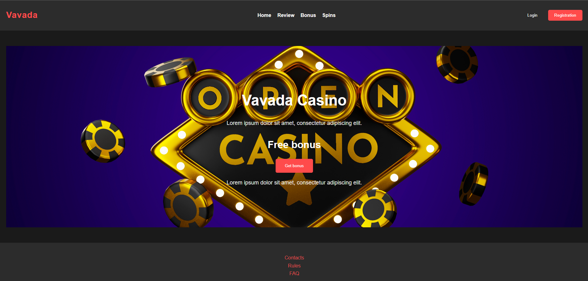

# Vavada Casino Landing Page

This project is a landing page for **Vavada Casino**, featuring a responsive design and interactive elements. The project is built using HTML, CSS, and JavaScript to implement the functionality and style.

## Live Demo
You can view the live version of this website at:
[Live Demo](https://sweet-mooncake-27f80a.netlify.app/)

## Project Description

The project includes the following main components:

- **Header**: Logo, navigation links (Home, Review, Bonus, Spins), Login and Registration buttons.
- **Content**: H1 header "Vavada Casino", text, banner with three different sizes for responsive design, "Get bonus" button.
- **Footer**: Navigation links (Contacts, Rules, FAQ), payment system logos (Visa, Maestro, Skrill), copyright information.
- Responsive design for different devices: desktop, tablet, mobile phones.
- Interactive elements powered by JavaScript.

## Technologies Used

- HTML5
- CSS3 (Flexbox)
- JavaScript

## Installation

1. Clone the repository:
   ```bash
   git clone https://github.com/yurazablotskiy/Casino_vavada.git
